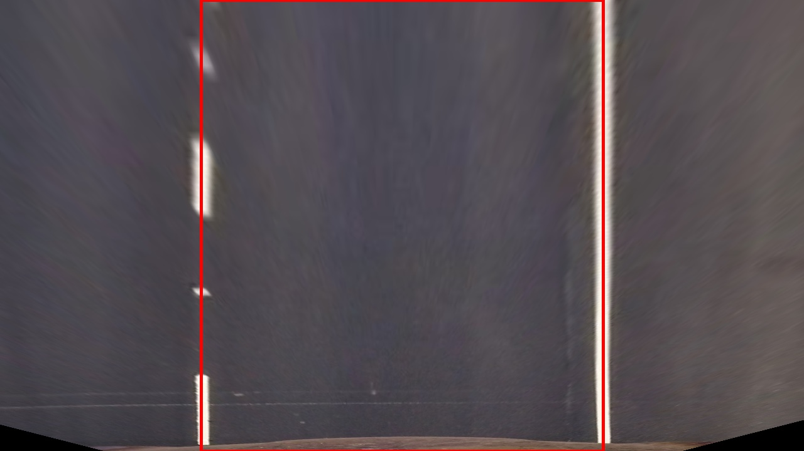

# Advanced Lane Finding Project

The goals / steps of this project are the following:

1. Compute the camera calibration matrix and distortion coefficients given a set of chessboard images.
2. Apply a distortion correction to raw images.
3. Use color transforms, gradients, etc., to create a thresholded binary image.
4. Apply a perspective transform to rectify binary image ("birds-eye view").
5. Detect lane pixels and fit to find the lane boundary.
6. Determine the curvature of the lane and vehicle position with respect to center.
7. Warp the detected lane boundaries back onto the original image.
8. Output visual display of the lane boundaries and numerical estimation of lane curvature and vehicle position.

---

## Includes/Libraries

Several standard python libraries are used, most notably CV2, PIL and moviepy.

Code from the lessons/quizzes was also modified and reused in corresponding processing stages 


```python
# Import(ant) stuff
import numpy as np
import cv2
import glob
import time
import pickle
import matplotlib.pyplot as plt
import matplotlib.image as mpimg
from PIL import Image
from PIL import ImageFont
from PIL import ImageDraw
from moviepy.editor import VideoFileClip
from moviepy.editor import *

from IPython.display import HTML

%matplotlib inline
#on a PC
#%matplotlib qt
```

## The Pipline

### 1. Camera Calibration

Camera calibration is preformed using several 9x6 chessboard calibration photos as follows:
1. Coordinates of the chessboard are gathered from every photo provided under directory `camera_cal` (if chessboard corners were successfully detected).
2. Camera calibration and distortion coefficients are calculated using `cv2.calibrateCamera()` function.
3. Calculated paramters are stored in a file using `pickle.dump` for future retrival.


```python
# prepare object points, like (0,0,0), (1,0,0), (2,0,0) ....,(6,5,0)
objp = np.zeros((6*9,3), np.float32)
objp[:,:2] = np.mgrid[0:9,0:6].T.reshape(-1,2)

# Arrays to store object points and image points from all the images.
objpoints = [] # 3d points in real world space
imgpoints = [] # 2d points in image plane.

# Make a list of calibration images
images = glob.glob('camera_cal/calibration*.jpg')

# Step through the list and search for chessboard corners
for fname in images:
    img = cv2.imread(fname)
    gray = cv2.cvtColor(img,cv2.COLOR_BGR2GRAY)
    
    # Find the chessboard corners
    ret, corners = cv2.findChessboardCorners(gray, (9,6),None)
    
    # If found, add object points, image points
    if ret == True:
        objpoints.append(objp)
        imgpoints.append(corners)

#Calculate calibration parameters
ret, mtx, dist, rvecs, tvecs = cv2.calibrateCamera(objpoints, imgpoints, (1280, 720), None, None)

#Store result
with open('cv2.calibrateCamera.pkl', 'wb') as f:
    pickle.dump([mtx, dist, rvecs, tvecs], f)
```

Distortion correction is performed on test images using the `cv2.undistort()` function.
The resulting images are stored under `output_images` directory.


```python
with open('cv2.calibrateCamera.pkl', 'rb') as f:
    mtx, dist, rvecs, tvecs = pickle.load(f) #Read calibration params

images = glob.glob('camera_cal/calibration*.jpg') # Make a list of images
# Step through the list to apply distortion correction and store the result
for fname in images:
    img = cv2.imread(fname)
    dst = cv2.undistort(img, mtx, dist, None, mtx)
    ret, corners = cv2.findChessboardCorners(cv2.cvtColor(dst,cv2.COLOR_BGR2GRAY), (9,6),None)
    dst = cv2.drawChessboardCorners(dst, (9,6), corners, ret)
    cv2.imwrite(fname.replace("camera_cal","output_images/dist_correction"),dst)
```

| Input         | Distortion-corrected|
|:-------------:|:-------------|
|  |  |


### 2. Distortion correction
Now, Applying the same distortion correction procedure to raw images provided under directory `test_images`
Then, storing the results under `output_images/dist_correction`


```python
images = glob.glob('test_images/*.jpg') # Make a list of images
# Step through the list to apply distortion correction and store the result
for fname in images:
    img = cv2.imread(fname)
    dst = cv2.undistort(img, mtx, dist, None, mtx)
    cv2.imwrite(fname.replace("test_images","output_images/dist_correction"),dst)
```


| Input         | Distortion-corrected|
|:-------------:|:-------------|
|  |  |


### 3. Creating a thresholded binary image

#### 3.1. Threshold Utilities


```python
# return 1 corresponding to pixels within `threshold [min, max]` and 0 otherwise
def bin_threshold_channel(channel,threshold):
    binary = np.zeros_like(channel)
    binary[(channel >= threshold[0]) & (channel <= threshold[1])] = 1
    return binary
```

For intermediate processing steps and visualization, the following utility functions are introduced to aid selective removal of certain pixels


```python
# returns the same values as input, except corresponding to pixels outside `threshold [min, max]` range are set to 0
def threshold_channel(channel,threshold):
    th_channel = np.copy(channel)
    th_channel[(channel <= threshold[0]) | (channel >= threshold[1])] = 0
    return th_channel
```


```python
# returns the same values as input, 0 corresponding to pixels from another `mask` outside `mask_thresh` range
def mask_channel(channel,mask,mask_thresh):
    masked = np.copy(channel)
    masked[(mask <= mask_thresh[0]) | (mask >= mask_thresh[1])] = 0
    return masked
```

#### 3.2. Gradient calculation

The utility funtction `gradient_calc` expects single color `channel` and applies `cv2.Sobel` in both X and Y directions.
outputs are:

1. Gradient in Y direction (scaled to 0:255)
2. Gradient in X direction (scaled to 0:255)
3. Gradient direction (in radiants)
4. Absolute Gradient magnitude (scaled to 0:255)


```python
#Gradient calculations
def gradient_calc(channel,sobel_kernel=15):
    #Calculate the x and y gradients
    sobelx = cv2.Sobel(channel, cv2.CV_64F, 1, 0, ksize=sobel_kernel)
    sobely = cv2.Sobel(channel, cv2.CV_64F, 0, 1, ksize=sobel_kernel)
    
    #Absolute sobel in x and y direction
    scaled_abssobelx = np.uint8(255*sobelx/np.max(np.absolute(sobelx)))
    scaled_abssobely = np.uint8(255*sobely/np.max(np.absolute(sobely)))
    
    #Gradient Direction: Take the absolute value of the gradient direction, 
    #apply a threshold, and create a binary image result
    grad_absddir = np.arctan2(np.absolute(sobely), np.absolute(sobelx))
    
    #Calculate the gradient magnitude
    gradmag = np.sqrt(sobelx**2 + sobely**2)
    #Rescale to 8 bit
    scale_factor = np.max(gradmag)/255 
    grad_mag = (gradmag/scale_factor).astype(np.uint8)
    
    return scaled_abssobely, scaled_abssobelx, grad_absddir, grad_mag
```

#### 3.3. Color channels

While RGB color channels can be easily obtained directy as follows:

`r,g,b = cv2.split(undist)`
    
The image needs to be converted to HLS color or LAB channels before splitting as shown below

`h,l,s = cv2.split(cv2.cvtColor(undist, cv2.COLOR_RGB2HLS))`

`lab_l,lab_a,lab_b = cv2.split(cv2.cvtColor(undist, cv2.COLOR_RGB2LAB))`

Histogram equalization is needed in some cases

`h_histeq = cv2.equalizeHist(h)`

#### 3.4 Example pipeline


```python
undist = cv2.imread("output_images/dist_correction/test1.jpg")
r,g,b = cv2.split(undist)
h,l,s = cv2.split(cv2.cvtColor(undist, cv2.COLOR_RGB2HLS))
```


```python
#Gradient threshold for color channel r
scaled_abssobely, scaled_abssobelx, grad_absddir, grad_mag = gradient_calc(r,sobel_kernel=15)

#keep only pixels with strong gradient in horizontal direction
grad_mag_masked = mask_channel(grad_mag,grad_absddir,(0.7, 1.3))

#keep top 30% of gradient magnitude values
r_min_thresh = np.max(grad_mag_masked)/3
r_binary = bin_threshold_channel(grad_mag_masked,(r_min_thresh,r_min_thresh*3))

# color threshold color channel s
s_binary = bin_threshold_channel(s,(150,255))

# combine both thresholded images
combined_th = np.dstack((np.zeros_like(s_binary), s_binary * 255, r_binary * 255))

#Show output of all steps/each step
grad_th_steps = cv2.cvtColor( np.hstack( (grad_mag, grad_mag_masked,r_binary*255) ), cv2.COLOR_GRAY2RGB)
color_th_steps = cv2.cvtColor( np.hstack( (s, s_binary*255) ), cv2.COLOR_GRAY2RGB)

diagnostic_frame = np.vstack( (grad_th_steps,np.hstack((color_th_steps,combined_th)) ))

cv2.imwrite("output_images/diagnostic/test1_bin_combined.jpg",combined_th)
cv2.imwrite("output_images/diagnostic/test1.jpg",diagnostic_frame)
```


    True


### 4. Prespective Transform

In order to generate birds-eye view of lanes, the transform is calculated to produce vertical parallel lines based on expected locations of start and end point of left and right lanes

Source point | Destination point
---|---
Left lane top|320, 0
Left lane bottom|320, 720
Right lane top|960, 0
Right lane top|960, 720


```python
def get_src_dest_coordinates(img_size):
    #define source points around expected left lane and right lane locations
    src = np.float32(
            [[(img_size[0] / 2) - 60, img_size[1] / 2 + 100],
            [ (img_size[0] / 6)     , img_size[1]],
            [ (img_size[0]*5/6) + 40, img_size[1]],
            [ (img_size[0] / 2) + 65, img_size[1] / 2 + 100]])

    #corresponding destination points
    dst = np.float32(
            [[(img_size[0]* 1 / 4), 0],
            [(img_size[0] * 1 / 4), img_size[1]],
            [(img_size[0] * 3 / 4), img_size[1]],
            [(img_size[0] * 3 / 4), 0]])
    return src, dst
```

Calculate transform `M` and inverse transform `Minv` from above `src` and `dest` coordinates.

Afterwards, Images can be transformed using the function `cv2.warpPerspective`.


```python
def get_transform(img_size):
    src,dst = get_src_dest_coordinates(img_size)
    M = cv2.getPerspectiveTransform(src, dst)
    Minv = cv2.getPerspectiveTransform(dst,src)
    # Return the resulting matrix
    return M, Minv
```

The transform is verifyed using provided test images named "straight_lines1.jpg" and "straight_lines2.jpg" (after distortion correction)


```python
# read image with straigt lines
undist = cv2.imread("output_images/dist_correction/straight_lines1.jpg")
ref_img_size = (undist.shape[1], undist.shape[0])

# calc transform based source and destination coordinates depending on image size
trns_M, trns_Minv = get_transform(ref_img_size)

# for visualtzation only
src_pts, dst_pts = get_src_dest_coordinates(ref_img_size)

# Warp the image using OpenCV warpPerspective()
wraped = cv2.warpPerspective(undist, trns_M, ref_img_size)
unwraped = cv2.warpPerspective(wraped, trns_Minv, ref_img_size)

# draw reference polygon overlay
cv2.polylines(undist, np.int32([src_pts]), 1, (0,0,255), thickness=3)
cv2.polylines(wraped, np.int32([dst_pts]), 1, (0,0,255), thickness=3)
cv2.polylines(unwraped, np.int32([src_pts]), 1, (0,0,255), thickness=3)

# store output for reference/analysis
cv2.imwrite("output_images/diagnostic/straight_lines1_marked.jpg",undist)
cv2.imwrite("output_images/diagnostic/straight_lines1_wrapped.jpg",wraped)
cv2.imwrite("output_images/diagnostic/straight_lines1_unwrapped.jpg",unwraped)

#repeat for second reference image
undist = cv2.imread("output_images/dist_correction/straight_lines2.jpg")
# Warp the image using OpenCV warpPerspective()
wraped = cv2.warpPerspective(undist, trns_M, ref_img_size)
unwraped = cv2.warpPerspective(wraped, trns_Minv, ref_img_size)

# draw reference polygon overlay
cv2.polylines(undist, np.int32([src_pts]), 1, (0,0,255), thickness=3)
cv2.polylines(wraped, np.int32([dst_pts]), 1, (0,0,255), thickness=3)
cv2.polylines(unwraped, np.int32([src_pts]), 1, (0,0,255), thickness=3)

# store output for reference/analysis
cv2.imwrite("output_images/diagnostic/straight_lines2_marked.jpg",undist)
cv2.imwrite("output_images/diagnostic/straight_lines2_wrapped.jpg",wraped)
cv2.imwrite("output_images/diagnostic/straight_lines2_unwrapped.jpg",unwraped)
```


    True


| Source Points         | Transform | Inverse transform |
|-------------|-------------|-------------|
|  |   |  
|  |   |  

### 5. Lane pixels identificiation

#### 5.1 Lane identification using sliding window Method
Starting from binary threshold image, which contains filtered birds-eye image of the lanes, starting points are identified by searching the bottom third of the image for histogram peaks. As shown in sliding window technique quizzes.

From there, we attempt to identify two columns of `nwindows` windows. These fixed-width windows are re-centered depending on activated pixels around the previous one's location.

Finally, pixels falling within re-centered windows are considered pixels for left and right lane.
Their coordinates are stored in `leftx,lefty` and `rightx,righty`


```python
def find_lane_pixels(binary_warped):
    # Take a histogram of the bottom third of the image
    histogram = np.sum(binary_warped[(binary_warped.shape[0]//2):,:], axis=0)
    # Create an output image to draw on and visualize the result
    out_img = np.dstack((binary_warped, binary_warped, binary_warped))
    # Find the peak of the left and right halves of the histogram
    # These will be the starting point for the left and right lines
    midpoint = np.int(histogram.shape[0]//2)
    first_third = midpoint//3
    
    leftx_base = np.argmax(histogram[first_third:midpoint]) + first_third
    rightx_base = np.argmax(histogram[midpoint:-first_third]) + midpoint

    # HYPERPARAMETERS
    # Choose the number of sliding windows
    nwindows = 4
    # Set the width of the windows +/- margin
    margin = 120
    # Set minimum number of pixels found to recenter window
    minpix = 25

    # Set height of windows - based on nwindows above and image shape
    window_height = np.int(binary_warped.shape[0]//nwindows)
    # Identify the x and y positions of all nonzero pixels in the image
    nonzero = binary_warped.nonzero()
    nonzeroy = np.array(nonzero[0])
    nonzerox = np.array(nonzero[1])
    # Current positions to be updated later for each window in nwindows
    leftx_current = leftx_base
    rightx_current = rightx_base

    # Create empty lists to receive left and right lane pixel indices
    left_lane_inds = []
    right_lane_inds = []

    # Step through the windows one by one
    for window in range(nwindows):
        # Identify window boundaries in x and y (and right and left)
        win_y_low = binary_warped.shape[0] - (window+1)*window_height
        win_y_high = binary_warped.shape[0] - window*window_height
        win_xleft_low = leftx_current - margin
        win_xleft_high = leftx_current + margin
        win_xright_low = rightx_current - margin
        win_xright_high = rightx_current + margin
        
        # Draw the windows on the visualization image
        cv2.rectangle(out_img,(win_xleft_low,win_y_low),
        (win_xleft_high,win_y_high),(0,255,0), 2) 
        cv2.rectangle(out_img,(win_xright_low,win_y_low),
        (win_xright_high,win_y_high),(0,255,0), 2) 
        
        # Identify the nonzero pixels in x and y within the window #
        good_left_inds = ((nonzeroy >= win_y_low) & (nonzeroy < win_y_high) & 
        (nonzerox >= win_xleft_low) &  (nonzerox < win_xleft_high)).nonzero()[0]
        good_right_inds = ((nonzeroy >= win_y_low) & (nonzeroy < win_y_high) & 
        (nonzerox >= win_xright_low) &  (nonzerox < win_xright_high)).nonzero()[0]
        
        # Append these indices to the lists
        left_lane_inds.append(good_left_inds)
        right_lane_inds.append(good_right_inds)
        
        # If you found > minpix pixels, recenter next window on their mean position
        if len(good_left_inds) > minpix:
            leftx_current = np.int(np.mean(nonzerox[good_left_inds]))
        if len(good_right_inds) > minpix:        
            rightx_current = np.int(np.mean(nonzerox[good_right_inds]))

    # Concatenate the arrays of indices (previously was a list of lists of pixels)
    try:
        left_lane_inds = np.concatenate(left_lane_inds)
        right_lane_inds = np.concatenate(right_lane_inds)
    except ValueError:
        # Avoids an error if the above is not implemented fully
        pass

    # Extract left and right line pixel positions
    leftx = nonzerox[left_lane_inds]
    lefty = nonzeroy[left_lane_inds] 
    rightx = nonzerox[right_lane_inds]
    righty = nonzeroy[right_lane_inds]
    
    return leftx, lefty, rightx, righty, out_img
```

#### 5.2 Polynomial fitting
Identified pixels are fit in second order polynomials


`left_fit` and `right_fit` hold the values `[A,B,C]` for each polynomial, representing the lane boundaries.


```python
def fit_poly(leftx, lefty, rightx, righty):
    try:
        ### TO-DO: Fit a second order polynomial to each with np.polyfit() ###
        left_fit = np.polyfit(lefty, leftx, 2)
        right_fit = np.polyfit(righty, rightx, 2)
    except TypeError:
        # Avoids an error if `left` and `right_fit` are still none or incorrect
        left_fit = np.array([ 0, 1, 1])
        right_fit = np.array([ 0, 1, 1])
        print('Fitting Failed!')
    return left_fit, right_fit

#Calculate function for values of a variable using second order polynomial coefficients
def calc_forV(variable,poly):
    x = poly[0]*variable**2 + poly[1]*variable + poly[2]
    return x


```

#### 5.3 Visualizing results


```python
def do_colorize(image,x,y,color=[255, 0, 0]):
    image[y,x]=color
    return image
```


```python
ref_img_size = (s_binary.shape[1], s_binary.shape[0])

# Warp the image using OpenCV warpPerspective()
s_wraped = cv2.warpPerspective(s_binary, trns_M, ref_img_size)
r_wraped = cv2.warpPerspective(r_binary, trns_M, ref_img_size)
bin_wraped = (s_wraped + r_wraped)* 255

color_binary = np.dstack((np.zeros_like(bin_wraped), s_wraped*255, r_wraped*255)) 

cv2.imwrite("output_images/diagnostic/test1_bin_wraped.jpg", color_binary)

leftx, lefty, rightx, righty, out_img = find_lane_pixels(bin_wraped)

# Colors in the left and right lane regions
color_binary[lefty, leftx] = [255, 0, 0]
color_binary[righty, rightx] = [255, 0, 0]
out_img[lefty, leftx] = [255, 0, 0]
out_img[righty, rightx] = [0, 0, 255]

cv2.imwrite("output_images/diagnostic/test1_bin_lane_pixels.jpg", out_img)

left_fit, right_fit = fit_poly(leftx, lefty, rightx, righty)

# Generate x and y values for plotting
ploty = np.linspace(0, color_binary.shape[0]-1, color_binary.shape[0])
### TO-DO: Calc both polynomials using ploty, left_fit and right_fit ###
left_fitx = calc_forV(ploty, left_fit) #left_fit[0]*ploty**2 + left_fit[1]*ploty + left_fit[2]
right_fitx = calc_forV(ploty, right_fit) #right_fit[0]*ploty**2 + right_fit[1]*ploty + right_fit[2]

#left_fitx, right_fitx, ploty = fit_poly(wraped.shape, leftx, lefty, rightx, righty)

color_binary[np.int32(ploty), np.int32(left_fitx)] = [255, 255, 255]
color_binary[np.int32(ploty), np.int32(right_fitx)] = [255, 255, 255]

cv2.imwrite("output_images/diagnostic/test1_bin_lane_fit.jpg", color_binary)
```


    True


| Possible lane pixels | lane identification |
|-------------|-------------|
|  |   |

##### Polynomial fitting result


### 6.Radius of curvature and vehicle position

We choose to to determine the curvature of the lanes at the image bottom.
Using the equations descibed in "Measuring Curvature" lesson, it can be calculated based on the polynomial fitting step outcome.

Vehicle position with respect to center is calculated using lane center position at the image bottom as well.


```python
# Define y-value where we want radius of curvature
# We'll choose the maximum y-value, corresponding to the bottom of the image
y_eval = np.max(ref_img_size[1])

# Calculation of R_curve (radius of curvature)
left_curverad = ((1 + (2*left_fit[0]* y_eval + left_fit[1]) **2)**1.5) / np.absolute(2*left_fit[0])
right_curverad= ((1 + (2*right_fit[0]*y_eval + right_fit[1])**2)**1.5) / np.absolute(2*right_fit[0])

pixels_from_center = (ref_img_size[0]/2) - ((right_fitx[-1] + left_fitx[-1]) / 2)
```

Scaling the calculations for the real world using meters per pixel ratio in X and Y dimensions 


```python
# Define conversions in x and y from pixels space to meters
ym_per_pix = 30/720 # meters per pixel in y dimension
xm_per_pix = 3.7/700 # meters per pixel in x dimension

#Polynomial scale
poly_scal_coeff = [xm_per_pix / (ym_per_pix ** 2), (xm_per_pix/ym_per_pix), 1]
left_fit_cr_scaled  =  left_fit * poly_scal_coeff
right_fit_cr_scaled = right_fit * poly_scal_coeff

meters_from_center = pixels_from_center * xm_per_pix

left_curverad_scaled =  ((1 + ((2* left_fit_cr_scaled[0]* (y_eval*ym_per_pix)) +  left_fit_cr_scaled[1])**2)**1.5) / np.absolute(2 *left_fit_cr_scaled[0])
right_curverad_scaled = ((1 + ((2*right_fit_cr_scaled[0]* (y_eval*ym_per_pix)) + right_fit_cr_scaled[1])**2)**1.5) / np.absolute(2*right_fit_cr_scaled[0])

print("Left lane radius {:10.2f} pixels {:10.2f} meters".format(left_curverad,left_curverad_scaled))
print("Right lane radius {:10.2f} pixels {:10.2f} meters".format(right_curverad,right_curverad_scaled))
print("Position from center {:10.2f} pixels {:10.2f} meters".format(pixels_from_center,meters_from_center))
```

    Left lane radius    2851.78 pixels     935.76 meters
    Right lane radius   35745.18 pixels   11675.08 meters
    Position from center     -29.52 pixels      -0.16 meters


### 7. Warp lane boundaries back onto the original image 


```python
def overlay_lane_region(result,left_fitx,right_fitx,ploty,InvTransform,color=(255,0,150)):
    # Create an image to draw the lines on
    color_warp = np.zeros_like(result).astype(np.uint8)
    # Recast the x and y points into usable format for cv2.fillPoly()
    pts_left = np.array([np.transpose(np.vstack([left_fitx, ploty]))])
    pts_right = np.array([np.flipud(np.transpose(np.vstack([right_fitx, ploty])))])
    pts = np.hstack((pts_left, pts_right))
    int_pts = np.int_([pts])

    # Draw the lane onto the warped blank image
    cv2.fillPoly(color_warp, int_pts, color)

    # Warp the blank back to original image space using inverse perspective matrix (Minv)
    newwarp = cv2.warpPerspective(color_warp, InvTransform, (result.shape[1], result.shape[0]))
    
    # Add it as 60% colored overlay
    result = cv2.addWeighted(result, 1, newwarp, 0.6, 0)
    return result
```

### 8. Overlay result visualization onto original image


```python
def print_calc_results(image,left_r,right_r,distance):
    font                   = cv2.FONT_HERSHEY_SIMPLEX
    bottomLeftCornerOfText = (100,50)
    fontScale              = 1
    fontColor              = (255,255,255)
    lineType               = 1

    cv2.putText(image,"Radius of curvature L{:10.2f}m R{:10.2f}m".format(left_r,right_r), 
        (100,50), 
        font, 
        fontScale,
        fontColor,
        lineType)

    cv2.putText(image,"Pos from center {:10.2f}m".format(distance), 
        (100,100), 
        font, 
        fontScale,
        fontColor,
        lineType)
    return image
```


```python
result = cv2.imread("output_images/dist_correction/test1.jpg")
result = overlay_lane_region(result,left_fitx,right_fitx,ploty,trns_Minv)
result = print_calc_results(result,left_curverad_scaled,right_curverad_scaled,meters_from_center)
cv2.imwrite("output_images/diagnostic/test1_overlay_result.jpg",result)
```


    True


## 9. Processing Video

Initially, the pipleline explained above was integrated in one function called from `moviepy` as an image filter.


```python
class VideoState():
    frame_size = (1280, 720)
    frameIdx = 0
    M = Minv = mtx = dist = rvecs = tvecs = []
    IsDiagnosticVideo = False

def initialize_video_processing(VideoClip, camera_calibration_pickle = 'cv2.calibrateCamera.pkl'):  
    #fix bug when no subclip is selected size isn't a tuple
    VideoState.frame_size = (VideoClip.size[0],VideoClip.size[1])
    
    # calc transform based source and destination coordinates depending on image size
    VideoState.M, VideoState.Minv = get_transform(VideoState.frame_size)
    
    with open(camera_calibration_pickle, 'rb') as f:
        mtx, dist, rvecs, tvecs = pickle.load(f) #Read calibration params
    
    VideoState.mtx = mtx
    VideoState.dist = dist
    
    return

def run_pipline_on_video_frame(img):
    #easy reference for parameters
    M = VideoState.M
    Minv = VideoState.Minv
    mtx = VideoState.mtx
    dist = VideoState.dist
    img_size = VideoState.frame_size
    
    #Camera distortion correction using parameters calculated earlier
    undist = cv2.undistort(img, mtx, dist, None, mtx)
    
    #Color channel selection
    r,g,b = cv2.split(undist) #BGR or RGB?
    h,l,s = cv2.split(cv2.cvtColor(undist, cv2.COLOR_RGB2HLS))
    gray = cv2.cvtColor(undist,cv2.COLOR_RGB2GRAY)
    
    #Gradient threshold for color channel r
    scaled_abssobely, scaled_abssobelx, grad_absddir, grad_mag = gradient_calc(r,sobel_kernel=15)
    #keep only pixels with strong gradient in horizontal direction
    r_grad_mag_masked = mask_channel(grad_mag,grad_absddir,(0.7, 1.3))
    r_min_thresh = np.max(r_grad_mag_masked)/3
    r_bin = bin_threshold_channel(r_grad_mag_masked,(r_min_thresh,r_min_thresh*3))
    r_bin_wraped = cv2.warpPerspective(r_bin, M, img_size)
    
    # color threshold color channel s
    s_bin = bin_threshold_channel(s,(150,255))
    s_bin_wrapped = cv2.warpPerspective(s_bin, M, img_size)

    # color threshold color channel h
    h_bin = bin_threshold_channel(h,(15,30))
    h_bin_wraped = cv2.warpPerspective(h_bin, M, img_size)
    
    bin_wraped = (r_bin_wraped + s_bin_wrapped + h_bin_wraped) * 255
    #color_binary = np.dstack((np.zeros_like(bin_wraped), s_wraped*255, r_wraped*255))
    color_binary = np.dstack((bin_wraped, bin_wraped, bin_wraped))
    
    ## Calculations ##
    # Find our lane pixels first
    leftx, lefty, rightx, righty, out_img = find_lane_pixels(bin_wraped)

    # Colors in the left and right lane regions
    color_binary[lefty, leftx] = [255, 0, 0]
    color_binary[righty, rightx] = [255, 0, 0]
    out_img[lefty, leftx] = [255, 0, 0]
    out_img[righty, rightx] = [0, 0, 255]

    left_fit, right_fit = fit_poly(leftx, lefty, rightx, righty)

    # Generate x and y values for plotting
    ploty = np.linspace(0, color_binary.shape[0]-1, color_binary.shape[0])
    ### TO-DO: Calc both polynomials using ploty, left_fit and right_fit ###
    left_fitx = calc_forV(ploty, left_fit) #left_fit[0]*ploty**2 + left_fit[1]*ploty + left_fit[2]
    right_fitx = calc_forV(ploty, right_fit) #right_fit[0]*ploty**2 + right_fit[1]*ploty + right_fit[2]
    
    left_fitx[left_fitx >= img_size[0]] = img_size[0]-1 
    right_fitx[right_fitx >= img_size[0]] = img_size[0]-1
    left_fitx[left_fitx < 0] = 0
    right_fitx[right_fitx < 0] = 0
    
    color_binary[np.int32(ploty), np.int32(left_fitx)] = [255, 255, 255]
    color_binary[np.int32(ploty), np.int32(right_fitx)] = [255, 255, 255]
    
    #cv2.imwrite("output_images/diagnostic/video_test_color_lanes{}.jpg".format(time.strftime("%Y%m%d%H%M%S")),out_img)
    #cv2.imwrite("output_images/diagnostic/video_test_color_bin{}.jpg".format(time.strftime("%Y%m%d%H%M%S")),color_binary)
    
    # Define y-value where we want radius of curvature
    # We'll choose the maximum y-value, corresponding to the bottom of the image
    y_eval = np.max(ploty)

    # Calculation of R_curve (radius of curvature)
    left_curverad = ((1 + (2*left_fit[0]* y_eval + left_fit[1]) **2)**1.5) / np.absolute(2*left_fit[0])
    right_curverad= ((1 + (2*right_fit[0]*y_eval + right_fit[1])**2)**1.5) / np.absolute(2*right_fit[0])

    pixels_from_center = (img_size[0]/2) - ((right_fitx[-1] + left_fitx[-1]) / 2)

    # Define conversions in x and y from pixels space to meters
    ym_per_pix = 30/720 # meters per pixel in y dimension
    xm_per_pix = 3.7/700 # meters per pixel in x dimension

    #Polynomial scale
    poly_scal_coeff = [xm_per_pix / (ym_per_pix ** 2), (xm_per_pix/ym_per_pix), 1]
    left_fit_cr_scaled  =  left_fit * poly_scal_coeff
    right_fit_cr_scaled = right_fit * poly_scal_coeff

    meters_from_center = pixels_from_center * xm_per_pix

    left_curverad_scaled =  ((1 + ((2* left_fit_cr_scaled[0]* (y_eval*ym_per_pix)) +  left_fit_cr_scaled[1])**2)**1.5) / np.absolute(2 *left_fit_cr_scaled[0])
    right_curverad_scaled = ((1 + ((2*right_fit_cr_scaled[0]* (y_eval*ym_per_pix)) + right_fit_cr_scaled[1])**2)**1.5) / np.absolute(2*right_fit_cr_scaled[0])
    
    result = overlay_lane_region(undist,left_fitx,right_fitx,ploty,Minv)
    result = print_calc_results(result,left_curverad_scaled,right_curverad_scaled,meters_from_center)
    
    return result
```


```python
project_video = 'project_video.mp4'

project_video_clip = VideoFileClip(project_video)
initialize_video_processing(project_video_clip)
processed_clip = project_video_clip.fl_image(run_pipline_on_video_frame) #NOTE: this function expects color images!!
%time processed_clip.write_videofile("video_samples/project_video_{}.mp4".format(time.strftime("%Y%m%d%H%M%S")), audio=False)
```

    [MoviePy] >>>> Building video video_samples/project_video_20181128205247.mp4
    [MoviePy] Writing video video_samples/project_video_20181128205247.mp4


    100%|█████████▉| 1260/1261 [10:01<00:00,  2.10it/s]


    [MoviePy] Done.
    [MoviePy] >>>> Video ready: video_samples/project_video_20181128205247.mp4 
    
    CPU times: user 7min 11s, sys: 35.1 s, total: 7min 46s
    Wall time: 10min 4s


### 9.1 Sample output

Output saved in the mp4 video below.

<video width="640" height="480" controls>
  <source src="video_samples/project_video_20181128205247.mp4" type="video/mp4">
</video>

As expected, [sample output video](video_samples/project_video_20181128205247.mp4 "sample output Video") shows several frames with incorrect or failed lane detections.


### 9.2 Video Exploration

Looking into diagnostic images for individual frames for debugging, proved impractical and time consuming.

There are so many differrent combinations of approaches to deal with variance in lighting conditions and situations througout the complete video. In addition, information from previous frames are not utilized in single frames.


```python
def h_stack(var):
    lst=[]
    for i,img in enumerate(var):
        lst.append(cv2.applyColorMap(img, cv2.COLORMAP_JET))
    return np.hstack( tuple(lst) )
def diagnostic_colorspaces(img):
    #easy reference for parameters
    M = VideoState.M
    Minv = VideoState.Minv
    mtx = VideoState.mtx
    dist = VideoState.dist
    img_size = VideoState.frame_size
    VideoState.frameIdx = VideoState.frameIdx + 1
    
    #Camera distortion correction using parameters calculated earlier
    undist = cv2.undistort(img, mtx, dist, None, mtx)
    #Visual guidance for RGB layers
    cv2.putText(undist,"R",(100,50),cv2.FONT_HERSHEY_SIMPLEX,1,(255,0,0),1)
    cv2.putText(undist,"  G",(100,50),cv2.FONT_HERSHEY_SIMPLEX,1,(0,255,0),1)
    cv2.putText(undist,"    B",(100,50),cv2.FONT_HERSHEY_SIMPLEX,1,(0,0,255),1)
    
    #Color channel selection
    rgb_r,rgb_g,rgb_b = cv2.split(undist) #BGR or RGB?
    hls_h,hls_l,hls_s = cv2.split(cv2.cvtColor(undist, cv2.COLOR_RGB2HLS))
    hsv_h,hsv_s,hsv_v = cv2.split(cv2.cvtColor(undist, cv2.COLOR_RGB2HSV))
    yuv_y,yuv_u,yuv_v = cv2.split(cv2.cvtColor(undist, cv2.COLOR_RGB2YUV))
    
    # combine both thresholded images
    #combined_th = np.dstack((np.zeros_like(s_binary), s_binary * 255, r_binary * 255))

    #Show output of all steps/each step
    #grad_th_steps = cv2.cvtColor( np.hstack( (grad_mag, grad_mag_masked,r_binary*255) ), cv2.COLOR_GRAY2RGB)
    #color_th_steps = cv2.cvtColor( np.hstack( (s, s_binary*255) ), cv2.COLOR_GRAY2RGB)

    diagnostic_frame = np.vstack( (h_stack((rgb_r,rgb_g,rgb_b)),
                                   h_stack((hls_h,hls_l,hls_s)),
                                   h_stack((hsv_h,hsv_s,hsv_v)),
                                   h_stack((yuv_y,yuv_u,yuv_v))))
    
    cv2.putText(diagnostic_frame,"Idx={}".format(VideoState.frameIdx),(200,50),cv2.FONT_HERSHEY_SIMPLEX,1,(255,255,255),1)
    
    return cv2.resize(diagnostic_frame, (0,0), fx=0.25, fy=0.25)
```


```python
project_video = 'project_video.mp4'
harder_challenge = 'harder_challenge_video.mp4'

project_video_clip = VideoFileClip(project_video)
initialize_video_processing(project_video_clip)
processed_clip = project_video_clip.fl_image(diagnostic_colorspaces) #NOTE: this function expects color images!!
%time processed_clip.write_videofile("video_samples/full_diag_project_video_{}.mp4".format(time.strftime("%Y%m%d%H%M%S")), audio=False)
```

    [MoviePy] >>>> Building video video_samples/full_diag_project_video_20181130182851.mp4
    [MoviePy] Writing video video_samples/full_diag_project_video_20181130182851.mp4


    100%|█████████▉| 1260/1261 [08:07<00:00,  2.67it/s]


    [MoviePy] Done.
    [MoviePy] >>>> Video ready: video_samples/full_diag_project_video_20181130182851.mp4 
    
    CPU times: user 4min 46s, sys: 1min 8s, total: 5min 54s
    Wall time: 8min 10s


```python
project_video = 'harder_challenge_video.mp4'

project_video_clip = VideoFileClip(project_video)
initialize_video_processing(project_video_clip)
processed_clip = project_video_clip.fl_image(diagnostic_colorspaces) #NOTE: this function expects color images!!
%time processed_clip.write_videofile("video_samples/full_diag_harder_challenge_video_{}.mp4".format(time.strftime("%Y%m%d%H%M%S")), audio=False)
```

    [MoviePy] >>>> Building video video_samples/full_diag_harder_challenge_video_20181130183703.mp4
    [MoviePy] Writing video video_samples/full_diag_harder_challenge_video_20181130183703.mp4


    100%|█████████▉| 1199/1200 [08:27<00:00,  2.28it/s]


    [MoviePy] Done.
    [MoviePy] >>>> Video ready: video_samples/full_diag_harder_challenge_video_20181130183703.mp4 
    
    CPU times: user 4min 31s, sys: 1min 5s, total: 5min 36s
    Wall time: 8min 32s


Using a color map helps us choose the better method for each color layer and what happens under different lighting/noise conditions.

After applying [cv::COLORMAP_JET ](https://docs.opencv.org/3.4/d3/d50/group__imgproc__colormap.html#gga9a805d8262bcbe273f16be9ea2055a65ab3f207661ddf74511b002b1acda5ec09) it's easy to see when lanes are further distinct from surroundings (blue vs. red) or when they're not (light blue vs. yellow).
The closer the colors, the more difficult it is to use color threshold methods.


As expected, [diagnostic video](video_samples/full_diag_project_video_20181130182851.mp4 "diagnostic Video") makes it easier to choose certain color channels which rely some distinctive features of the lanes reliably.

It's also clear that, some noisy situations will require gradient filtering rather than color filtering.

This gives us a starting point but isn't quite sufficient.

<video width="640" height="480" controls>
  <source src="video_samples/full_diag_project_video_20181130182851.mp4" type="video/mp4">
</video>


### 9.3 Augmented video diagnostics

Then, we tweak the pipleine utilizing the same technique on intermediate ouput of pipeline stages.

This time, we also focus on tricky section(s) of the videos and fine-tune the parameters and processing steps.


```python
def run_pipline_on_video_frame_with_diag(img):
    #easy reference for parameters
    M = VideoState.M
    Minv = VideoState.Minv
    mtx = VideoState.mtx
    dist = VideoState.dist
    img_size = VideoState.frame_size
    
    #Camera distortion correction using parameters calculated earlier
    undist = cv2.undistort(img, mtx, dist, None, mtx)
    
    #Color channel selection
    #r,g,b = cv2.split(undist) #BGR or RGB?
    #h,l,s = cv2.split(cv2.cvtColor(undist, cv2.COLOR_RGB2HLS))
    #gray = cv2.cvtColor(undist,cv2.COLOR_RGB2GRAY)
    #Color channel selection
    rgb_r,rgb_g,rgb_b = cv2.split(undist) #BGR or RGB?
    hls_h,hls_l,hls_s = cv2.split(cv2.cvtColor(undist, cv2.COLOR_RGB2HLS))
    hsv = cv2.cvtColor(undist, cv2.COLOR_RGB2HSV)
    hsv_h,hsv_s,hsv_v = cv2.split(hsv)
    yuv_y,yuv_u,yuv_v = cv2.split(cv2.cvtColor(undist, cv2.COLOR_RGB2YUV))
    
    #Gradient threshold for color channel r
    scaled_abssobely, scaled_abssobelx, grad_absddir, grad_mag = gradient_calc(rgb_r,sobel_kernel=15)
    #keep only pixels with strong gradient in horizontal direction
    r_grad_mag_masked = mask_channel(grad_mag,grad_absddir,(0.7, 1.3))
    r_min_thresh = np.max(r_grad_mag_masked)/3
    r_bin = bin_threshold_channel(r_grad_mag_masked,(r_min_thresh,r_min_thresh*3))
    r_bin_wraped = cv2.warpPerspective(r_bin, M, img_size)
    
    # color threshold color channel s
    s_bin = bin_threshold_channel(hls_s,(150,255))
    s_bin_wrapped = cv2.warpPerspective(s_bin, M, img_size)
    s_scaled_abssobely, s_scaled_abssobelx, s_grad_absddir, s_grad_mag = gradient_calc(hls_s,sobel_kernel=15)
    s_grad_mag_masked = mask_channel(s_grad_mag,s_grad_absddir,(0.8, 1.2))
    s_max_thresh = np.max(s_grad_mag_masked)
    s_min_thresh = s_max_thresh*2/3
    sg_bin = bin_threshold_channel(s_grad_mag_masked,(s_min_thresh,s_max_thresh))
    sg_bin_wraped = cv2.warpPerspective(sg_bin, M, img_size)
    
    # color threshold color channel h
    h_bin = bin_threshold_channel(hls_h,(10,20))
    h_bin_wraped = cv2.warpPerspective(h_bin, M, img_size)
    h_scaled_abssobely, h_scaled_abssobelx, h_grad_absddir, h_grad_mag = gradient_calc(s_bin,sobel_kernel=15)
    h_grad_mag_masked = mask_channel(h_grad_mag,h_grad_absddir,(0.8, 1.2))
    h_max_thresh = np.max(h_grad_mag_masked)
    h_min_thresh = h_max_thresh*2/3
    hg_bin = bin_threshold_channel(h_grad_mag_masked,(h_min_thresh,h_max_thresh))
    hg_bin_wraped = cv2.warpPerspective(hg_bin, M, img_size)
    
    #Gradient threshold for color channel r
    y_scaled_abssobely, y_scaled_abssobelx, y_grad_absddir, y_grad_mag = gradient_calc(yuv_y,sobel_kernel=15)
    #keep only pixels with strong gradient in horizontal direction
    y_grad_mag_masked = mask_channel(y_grad_mag,y_grad_absddir,(0.7, 1.3))
    y_max_thresh = np.max(y_grad_mag_masked)
    y_min_thresh = np.max(y_grad_mag_masked)/3
    y_bin = bin_threshold_channel(y_grad_mag_masked,(r_min_thresh,y_max_thresh))
    y_bin_wraped = cv2.warpPerspective(y_bin, M, img_size)
    
    yellow_hsv_low  = np.array([ 0,  100,  100])
    yellow_hsv_high = np.array([ 80, 255, 255])
    hsv_yellow = cv2.inRange(hsv, yellow_hsv_low, yellow_hsv_high)
    
    white_hsv_range = 30
    white_hsv_low  = np.array([ 0,   0,   255-white_hsv_range])
    white_hsv_high = np.array([ 255, white_hsv_range, 255])
    
    hsv_white = cv2.inRange(hsv, white_hsv_low, white_hsv_high)
    
    #hsv_color = bin_threshold_channel(cv2.cvtColor(cv2.bitwise_or(hsv_white,hsv_yellow),cv2.COLOR_RGB2GRAY),(10,255))
    hsv_color = hsv_white + hsv_yellow
    hsv_color_wraped = cv2.warpPerspective(hsv_color, M, img_size)
    
    if(VideoState.IsDiagnosticVideo):
        diagnostic_frame = np.vstack( (h_stack((rgb_r,scaled_abssobelx,grad_mag  ,r_grad_mag_masked)),
                                       h_stack((hls_s,s_scaled_abssobelx,s_grad_mag,s_grad_mag_masked)),
                                       h_stack((hls_h,h_scaled_abssobelx,h_grad_mag,h_grad_mag_masked)),
                                       h_stack((yuv_y,y_scaled_abssobelx,y_grad_mag,y_grad_mag_masked))))

        binary_output_frame = (np.hstack((bin_threshold_channel(hls_h,(0,10)),
                                          bin_threshold_channel(hls_h,(20,30)),
                                          r_bin_wraped , hsv_color , hsv_color_wraped , sg_bin_wraped , hg_bin_wraped , y_bin_wraped)) * 255)

    bin_wraped = ((r_bin_wraped + sg_bin_wraped + hg_bin_wraped + y_bin_wraped + hsv_color_wraped) * 255) #((s_bin_wrapped + h_bin_wraped)* 64) 
    #color_binary = np.dstack((np.zeros_like(bin_wraped), s_wraped*255, r_wraped*255))
    color_binary = np.dstack((bin_wraped, bin_wraped, bin_wraped))
    
    ## Calculations ##
    # Find our lane pixels first
    leftx, lefty, rightx, righty, out_img = find_lane_pixels(bin_wraped)

    # Colors in the left and right lane regions
    color_binary[lefty, leftx] = [255, 0, 0]
    color_binary[righty, rightx] = [255, 0, 0]
    out_img[lefty, leftx] = [255, 0, 0]
    out_img[righty, rightx] = [0, 0, 255]

    left_fit, right_fit = fit_poly(leftx, lefty, rightx, righty)

    # Generate x and y values for plotting
    ploty = np.linspace(0, color_binary.shape[0]-1, color_binary.shape[0])
    ### TO-DO: Calc both polynomials using ploty, left_fit and right_fit ###
    left_fitx = calc_forV(ploty, left_fit) #left_fit[0]*ploty**2 + left_fit[1]*ploty + left_fit[2]
    right_fitx = calc_forV(ploty, right_fit) #right_fit[0]*ploty**2 + right_fit[1]*ploty + right_fit[2]
    
    left_fitx[left_fitx >= img_size[0]] = img_size[0]-1 
    right_fitx[right_fitx >= img_size[0]] = img_size[0]-1
    left_fitx[left_fitx < 0] = 0
    right_fitx[right_fitx < 0] = 0
    
    color_binary[np.int32(ploty), np.int32(left_fitx)] = [255, 255, 255]
    color_binary[np.int32(ploty), np.int32(right_fitx)] = [255, 255, 255]
    
    #cv2.imwrite("output_images/diagnostic/video_test_color_lanes{}.jpg".format(time.strftime("%Y%m%d%H%M%S")),out_img)
    #cv2.imwrite("output_images/diagnostic/video_test_color_bin{}.jpg".format(time.strftime("%Y%m%d%H%M%S")),color_binary)
    
    # Define y-value where we want radius of curvature
    # We'll choose the maximum y-value, corresponding to the bottom of the image
    y_eval = np.max(ploty)

    # Calculation of R_curve (radius of curvature)
    left_curverad = ((1 + (2*left_fit[0]* y_eval + left_fit[1]) **2)**1.5) / np.absolute(2*left_fit[0])
    right_curverad= ((1 + (2*right_fit[0]*y_eval + right_fit[1])**2)**1.5) / np.absolute(2*right_fit[0])

    pixels_from_center = (img_size[0]/2) - ((right_fitx[-1] + left_fitx[-1]) / 2)

    # Define conversions in x and y from pixels space to meters
    ym_per_pix = 30/720 # meters per pixel in y dimension
    xm_per_pix = 3.7/700 # meters per pixel in x dimension

    #Polynomial scale
    poly_scal_coeff = [xm_per_pix / (ym_per_pix ** 2), (xm_per_pix/ym_per_pix), 1]
    left_fit_cr_scaled  =  left_fit * poly_scal_coeff
    right_fit_cr_scaled = right_fit * poly_scal_coeff

    meters_from_center = pixels_from_center * xm_per_pix

    left_curverad_scaled =  ((1 + ((2* left_fit_cr_scaled[0]* (y_eval*ym_per_pix)) +  left_fit_cr_scaled[1])**2)**1.5) / np.absolute(2 *left_fit_cr_scaled[0])
    right_curverad_scaled = ((1 + ((2*right_fit_cr_scaled[0]* (y_eval*ym_per_pix)) + right_fit_cr_scaled[1])**2)**1.5) / np.absolute(2*right_fit_cr_scaled[0])
    
    result = overlay_lane_region(undist,left_fitx,right_fitx,ploty,Minv)
    result = print_calc_results(result,left_curverad_scaled,right_curverad_scaled,meters_from_center)
    
    if(VideoState.IsDiagnosticVideo):
        result = np.vstack((np.hstack((result,cv2.resize(diagnostic_frame, (0,0), fx=0.25, fy=0.25))),
                             cv2.cvtColor(cv2.resize(binary_output_frame, (0,0), fx=1/4, fy=1/4),cv2.COLOR_GRAY2RGB),
                          np.hstack((out_img,color_binary))))
    return result
```


```python
project_video = 'project_video.mp4'

VideoState.IsDiagnosticVideo = True
project_video_clip = VideoFileClip(project_video).subclip(35,45)
initialize_video_processing(project_video_clip)
processed_clip = project_video_clip.fl_image(run_pipline_on_video_frame_with_diag) #NOTE: this function expects color images!!
%time processed_clip.write_videofile("video_samples/augmented_project_video_s35_{}.mp4".format(time.strftime("%Y%m%d%H%M%S")), audio=False)
```

    [MoviePy] >>>> Building video video_samples/augmented_project_video_s35_20181204073743.mp4
    [MoviePy] Writing video video_samples/augmented_project_video_s35_20181204073743.mp4


    100%|█████████▉| 250/251 [06:18<00:01,  1.52s/it]


    [MoviePy] Done.
    [MoviePy] >>>> Video ready: video_samples/augmented_project_video_s35_20181204073743.mp4 
    
    CPU times: user 4min 39s, sys: 14.3 s, total: 4min 53s
    Wall time: 6min 29s


Augmented diagnostic and final video output saved in the mp4 video below.

After several changes in the pipeline [augmented diangnostic video](video_samples/augmented_project_video_s35_20181204073743.mp4 "sample augmented diagnostic Video") shows how the pipeline stages behave under different conditions.


<video width="640" height="480" controls>
  <source src="video_samples/augmented_project_video_s35_20181204073743.mp4" type="video/mp4">
</video>

To summerize changes in the pipeline, after visual analysis of the intermediate results of the different filters, it became clear that:

1. Color threshold on single channel isn't reliable in many situations. a [good alternative using hsv for tracking yellow was described here](https://towardsdatascience.com/robust-lane-finding-using-advanced-computer-vision-techniques-mid-project-update-540387e95ed3) some enhancements were required as suggested by the resources on [Object Tracking
](https://opencv-python-tutroals.readthedocs.io/en/latest/py_tutorials/py_imgproc/py_colorspaces/py_colorspaces.html#object-tracking) and [Tracking white using opencv](https://stackoverflow.com/questions/22588146/tracking-white-color-using-python-opencv)
2. Gradient directional threshold for `hls_s` and `hls_h` need to be more selective
3. window margin for `find_lane_pixels` step needs to be wider in order to obtain better curve-following


```python
project_video = 'project_video.mp4'

VideoState.IsDiagnosticVideo = True
project_video_clip = VideoFileClip(project_video)
initialize_video_processing(project_video_clip)
processed_clip = project_video_clip.fl_image(run_pipline_on_video_frame_with_diag) #NOTE: this function expects color images!!
%time processed_clip.write_videofile("video_samples/full_augmented_project_video{}.mp4".format(time.strftime("%Y%m%d%H%M%S")), audio=False)
```

    [MoviePy] >>>> Building video video_samples/full_augmented_project_video20181203211246.mp4
    [MoviePy] Writing video video_samples/full_augmented_project_video20181203211246.mp4


    
      0%|          | 0/1261 [00:00<?, ?it/s]
      0%|          | 1/1261 [00:01<25:57,  1.24s/it]
    100%|█████████▉| 1260/1261 [31:58<00:01,  1.54s/it]


    [MoviePy] Done.
    [MoviePy] >>>> Video ready: video_samples/full_augmented_project_video20181203211246.mp4 
    
    CPU times: user 23min 49s, sys: 56 s, total: 24min 45s
    Wall time: 32min 9s


## 10. Final video output


```python
project_video = 'project_video.mp4'

VideoState.IsDiagnosticVideo = False
project_video_clip = VideoFileClip(project_video)
initialize_video_processing(project_video_clip)
processed_clip = project_video_clip.fl_image(run_pipline_on_video_frame_with_diag) #NOTE: this function expects color images!!
%time processed_clip.write_videofile("video_output/full_project_video{}.mp4".format(time.strftime("%Y%m%d%H%M%S")), audio=False)
```

    [MoviePy] >>>> Building video video_output/full_project_video20181204074413.mp4
    [MoviePy] Writing video video_output/full_project_video20181204074413.mp4


    100%|█████████▉| 1260/1261 [22:02<00:01,  1.03s/it]


    [MoviePy] Done.
    [MoviePy] >>>> Video ready: video_output/full_project_video20181204074413.mp4 
    
    CPU times: user 19min 38s, sys: 3.4 s, total: 19min 41s
    Wall time: 22min 5s


[Final output video](video_output/full_project_video20181204074413.mp4 "output Video") is saved in the mp4 video below.

<video width="640" height="480" controls>
  <source src="video_output/full_project_video20181204074413.mp4" type="video/mp4">
</video>

## 11. Discussion

#### 11.1 Implementation Notes

1. The current pipelines fails to follow sudden changes in lane radius, treating the whole image as one curve doesn't seem to work all the time even under normal conditions
2. Camera is basically blind in several segments of harder challenge
3. When there is only one lane line visible, radius of curvature is relatively small, or the vehicle isn't driving near the right direction the current implementation will fail

#### 11.2 Possible enhancements

1. Split each photo into slightly overlapping segments, fit each segment individually
2. Several performance enhancements possible for example: searching for lane pixels around prior fit
3. Smoothing (low-pass filtering) lane positions
4. Applying DeepLearning techniques to enhance lane detection

